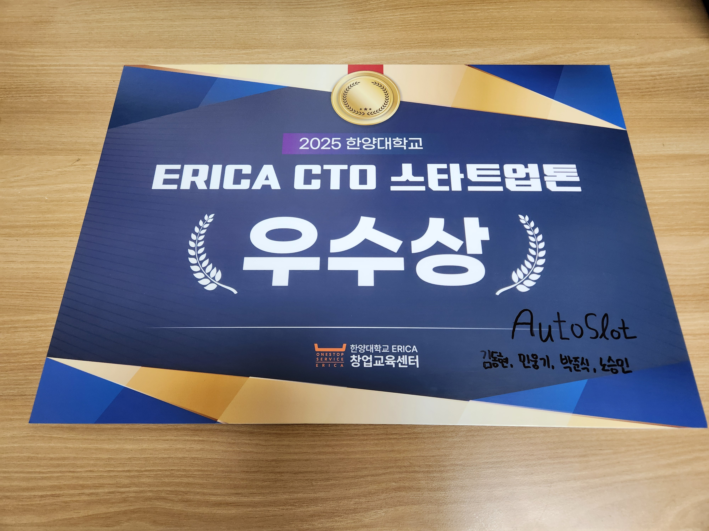

## ERICA_CTO_StartUp_Ton

## 🏆 수상

* **ERICA CTO StartUp-Ton 3위(우수상) 수상**

## 🤖 AutoSlot (주차 안내 로봇 솔루션)
> 대형 쇼핑몰 및 백화점의 고질적인 주차 혼잡 문제를 자율주행 로봇으로 해결하는 스마트 주차 가이드 솔루션

---

## 📂 Project Structure

* 로봇 동작 프로세스 시각화

 

* **`demo_application`**: 제품 상세페이지
* **`demo_page`**: 로봇 수용 범위를 넘어선 차량들을 위한 **앱 연동 주차장 지도**

---

## ⚡ Pain Point

* **주차장 혼잡의 주범:** 빈자리를 찾기 위해 주차장을 배회하는 차량들로 인해 불필요한 정체 발생.
* **비효율적인 안내 인력:** 인력 고용 및 교육에 따른 고비용 문제와 안전사고 위험 존재.

## 🚀 주요 기능

* **빈자리로의 안내:** 로봇이 수용 가능한 범위 내의 차량을 빈자리까지 직접 안내
* **주차장 지도 연동:** 로봇 수용 범위를 넘어선 경우, 전용 어플리케이션이나 웹 사이트 형태의 실시간 주차 지도를 통해 안내 (`demo_page` 브랜치 참고)

<!--
## 💰 비즈니스 모델 (Business Model)

* **구매 옵션:**
    * **구독형:** 월 이용료 30만 원 / 45만 원 (관리 서비스 포함)
    * **일시불:** 1,800만 원 / 1,900만 원 (광고 패널 및 옵션에 따른 차등)
